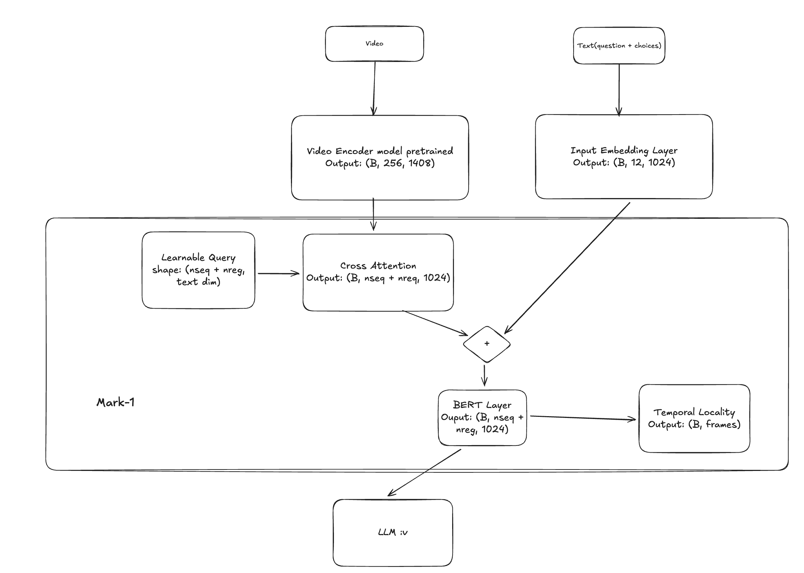

# Mark-1 Projection 

**Note**: Output of Video Encoder will go through simple linear to `(B, 256, 1024)`

## Design Rationale: The Projection Mechanism

1. **The "Query" Strategy**: Instead of feeding the raw, high-dimensional output from the Video Encoder (256 tokens) directly into the LLM, we employ Learnable Queries ($nseq=32 + nreg=5$) as a bottleneck.

2. Why **Cross-Attention**? The **Cross-Attention** mechanism allows these Learnable Queries to dynamically attend to and extract only the most salient visual information from the video features. This acts as a semantic compression step, filtering out redundancy (background noise) before the data reaches the language model.

3. Context Fusion (BERT):The extracted visual tokens are then fused with text embeddings via a BERT layer to inject textual context before final regression and generation.